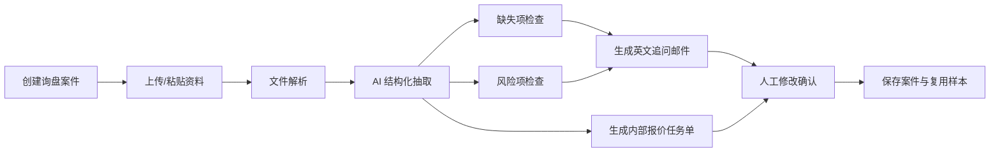

# 询盘资料审查 Agent MVP 需求文档

## 1. 项目定位

把现有外贸 AI Agent 系统从“单点工具集合”升级为“询盘到报价前的资料审查工作流”。

MVP 的目标不是自动报价，也不是自动替业务员发邮件，而是把客户给的杂乱资料整理成三类可执行成果：

1. 销售可确认的结构化需求表
2. 客户可回复的英文追问邮件
3. 内部报价/工程/采购可执行的任务单

一句话目标：

> 把客户邮件、Excel、PDF、图片等资料，自动整理成可审查、可修改、可复用的询盘资料包。

## 2. 目标用户

### 2.1 外贸销售

关注点：

- 快速判断客户到底要什么
- 发现报价前必须追问的信息
- 生成专业英文回复
- 减少反复翻资料、问同事、补字段的时间

### 2.2 销售经理

关注点：

- 统一报价前资料标准
- 识别高价值询盘和高风险询盘
- 让新人也能按标准流程处理客户资料
- 查看团队处理效率和资料完整度

### 2.3 报价/工程/采购同事

关注点：

- 收到清晰的内部任务单
- 明确哪些信息已确认、哪些还缺失
- 减少“资料不全无法报价”的返工

## 3. MVP 范围

### 3.1 本期必须做

- 创建询盘案件
- 上传或粘贴客户资料
- 解析 PDF、Word、TXT、Excel、邮件正文
- AI 抽取结构化需求字段
- AI 判断缺失字段
- AI 判断报价风险
- AI 生成客户追问邮件草稿
- AI 生成内部报价任务单
- 支持人工修改、保存、复用

### 3.2 本期暂不做

- 自动发送邮件
- 自动生成最终报价单
- 自动承诺价格、交期、付款条款
- 自动同步外部 CRM
- 全渠道邮箱实时监听
- 完整 OCR 扫描件识别
- 多 Agent 自主协商决策

## 4. 核心业务流程



## 5. 页面规划

### 5.1 新增页面

页面名称：

`询盘资料审查 Agent`

建议路由：

`/inquiry-review`

建议导航归属：

`功能 -> 外贸工作流`

### 5.2 页面结构

页面采用三栏工作台。

#### 左栏：资料区

功能：

- 创建/选择询盘案件
- 填写客户基本信息
- 粘贴邮件正文
- 上传附件
- 查看解析状态
- 查看原始资料预览

字段：

- 客户公司
- 联系人
- 邮箱
- 国家/地区
- 来源渠道
- 询盘标题
- 原始邮件正文
- 附件列表

#### 中栏：结构化需求区

功能：

- 展示 AI 抽取结果
- 字段置信度提示
- 字段来源证据
- 人工编辑字段
- 标记字段已确认/待确认

字段分组：

- 项目信息
- 产品信息
- 规格尺寸
- 数量与包装
- 材料与配件
- 贸易与物流
- 时间与预算
- 认证与合规

#### 右栏：行动区

功能：

- 缺失项清单
- 风险项清单
- 英文追问邮件
- 内部报价任务单
- 保存最终版本
- 复制邮件
- 创建内部任务

## 6. 数据模型建议

### 6.1 InquiryCase

询盘案件主表。

| 字段 | 类型 | 说明 |
| --- | --- | --- |
| id | Long | 主键 |
| caseNo | String | 案件编号 |
| title | String | 询盘标题 |
| customerName | String | 客户公司 |
| contactName | String | 联系人 |
| contactEmail | String | 联系邮箱 |
| country | String | 国家/地区 |
| source | String | 来源渠道 |
| status | String | DRAFT / REVIEWING / WAITING_CUSTOMER / READY_TO_QUOTE / CLOSED |
| score | Integer | 询盘价值评分 |
| summary | Text | AI 摘要 |
| ownerId | String | 负责人 |
| createdAt | DateTime | 创建时间 |
| updatedAt | DateTime | 更新时间 |

### 6.2 InquiryArtifact

客户资料附件表。

| 字段 | 类型 | 说明 |
| --- | --- | --- |
| id | Long | 主键 |
| caseId | Long | 询盘案件 ID |
| fileName | String | 文件名 |
| fileType | String | PDF / DOCX / TXT / XLSX / EMAIL_TEXT / IMAGE |
| sourceType | String | UPLOAD / PASTE / EMAIL |
| rawText | Text | 解析后的文本 |
| parseStatus | String | PENDING / SUCCESS / FAILED |
| parseError | Text | 解析失败原因 |
| createdAt | DateTime | 创建时间 |

### 6.3 ExtractedRequirement

结构化字段表。

| 字段 | 类型 | 说明 |
| --- | --- | --- |
| id | Long | 主键 |
| caseId | Long | 询盘案件 ID |
| fieldKey | String | 字段键 |
| fieldLabel | String | 字段名 |
| fieldValue | Text | 字段值 |
| confidence | Decimal | 置信度 |
| sourceEvidence | Text | 来源证据 |
| status | String | AI_EXTRACTED / USER_CONFIRMED / MISSING / NEED_CONFIRM |
| updatedBy | String | 最后修改人 |
| updatedAt | DateTime | 更新时间 |

### 6.4 MissingField

缺失字段表。

| 字段 | 类型 | 说明 |
| --- | --- | --- |
| id | Long | 主键 |
| caseId | Long | 询盘案件 ID |
| fieldKey | String | 缺失字段 |
| reason | Text | 为什么需要补充 |
| questionEn | Text | 英文追问句 |
| priority | String | HIGH / MEDIUM / LOW |

### 6.5 RiskFlag

风险项表。

| 字段 | 类型 | 说明 |
| --- | --- | --- |
| id | Long | 主键 |
| caseId | Long | 询盘案件 ID |
| riskType | String | SPEC / PRICE / DELIVERY / PAYMENT / COMPLIANCE / LOGISTICS |
| level | String | HIGH / MEDIUM / LOW |
| title | String | 风险标题 |
| description | Text | 风险说明 |
| suggestion | Text | 处理建议 |

### 6.6 QuoteTaskDraft

内部报价任务草稿。

| 字段 | 类型 | 说明 |
| --- | --- | --- |
| id | Long | 主键 |
| caseId | Long | 询盘案件 ID |
| taskTitle | String | 任务标题 |
| knownInfo | Text | 已知信息 |
| missingInfo | Text | 缺失信息 |
| riskSummary | Text | 风险摘要 |
| assigneeRole | String | SALES / ENGINEERING / PURCHASING / MANAGER |
| status | String | DRAFT / CONFIRMED / CREATED |

## 7. AI 抽取字段 Schema

MVP 第一版建议抽取以下字段。

### 7.1 项目信息

- projectName
- customerCompany
- customerCountry
- inquirySource
- buyerStage
- intendedUse

### 7.2 产品信息

- productType
- productName
- productCategory
- applicationScenario
- targetMarket

### 7.3 规格尺寸

- width
- height
- depth
- thickness
- sizeUnit
- drawingProvided

### 7.4 数量与包装

- quantity
- moqAccepted
- packagingRequirement
- cartonRequirement
- palletRequirement

### 7.5 材料与配件

- material
- color
- surfaceFinish
- glass
- hardware
- accessories

### 7.6 贸易与物流

- tradeTerm
- destinationPort
- deliveryAddress
- shippingMethod
- hsCodeHint

### 7.7 时间与预算

- targetPrice
- budgetSignal
- sampleDeadline
- deliveryDeadline
- urgency

### 7.8 认证与合规

- certificationRequired
- complianceRequirement
- marketRegulation
- testRequirement

## 8. Prompt 输出格式

AI 结构化抽取必须返回 JSON，禁止只返回自然语言。

```json
{
  "summary": "客户想采购一批铝合金门窗，用于美国住宅项目，目前缺少玻璃配置和目的港信息。",
  "score": 78,
  "requirements": [
    {
      "fieldKey": "productType",
      "fieldLabel": "产品类型",
      "fieldValue": "aluminum sliding window",
      "confidence": 0.86,
      "sourceEvidence": "Email line 4: aluminum sliding window",
      "status": "AI_EXTRACTED"
    }
  ],
  "missingFields": [
    {
      "fieldKey": "glass",
      "reason": "门窗报价需要确认玻璃类型、厚度和是否中空玻璃。",
      "questionEn": "Could you please confirm the glass type and thickness required for this project?",
      "priority": "HIGH"
    }
  ],
  "risks": [
    {
      "riskType": "SPEC",
      "level": "MEDIUM",
      "title": "玻璃配置不明确",
      "description": "客户提供了门窗尺寸，但未说明玻璃结构，可能影响报价准确性。",
      "suggestion": "报价前先向客户确认 glass type, thickness and insulation requirement."
    }
  ],
  "customerEmailDraft": "Dear ...",
  "internalTaskDraft": {
    "taskTitle": "Prepare quotation for aluminum sliding window inquiry",
    "knownInfo": "...",
    "missingInfo": "...",
    "riskSummary": "..."
  }
}
```

## 9. 后端 API 建议

### 9.1 创建询盘案件

`POST /api/inquiry-review/cases`

请求：

```json
{
  "title": "US aluminum window inquiry",
  "customerName": "ABC Builder",
  "contactName": "John",
  "contactEmail": "john@example.com",
  "country": "US",
  "source": "email"
}
```

### 9.2 获取案件详情

`GET /api/inquiry-review/cases/{caseId}`

返回案件、资料、字段、缺失项、风险项、邮件草稿、任务草稿。

### 9.3 上传资料

`POST /api/inquiry-review/cases/{caseId}/artifacts`

支持：

- multipart file
- pasted email text

### 9.4 执行 AI 审查

`POST /api/inquiry-review/cases/{caseId}/analyze`

动作：

- 汇总案件资料
- 调用 LLM 抽取结构化字段
- 保存字段、缺失项、风险项、草稿

### 9.5 更新字段

`PUT /api/inquiry-review/cases/{caseId}/requirements/{fieldId}`

### 9.6 保存邮件草稿

`PUT /api/inquiry-review/cases/{caseId}/email-draft`

### 9.7 保存内部任务单

`PUT /api/inquiry-review/cases/{caseId}/quote-task-draft`

### 9.8 创建 v2 内部任务

`POST /api/inquiry-review/cases/{caseId}/create-task`

可对接现有 `/api/v2/tasks`。

## 10. 和现有系统的关系

### 10.1 可复用能力

| 现有模块 | 复用方式 |
| --- | --- |
| AgentRuntime | 执行 AI 分析和生成 |
| FileParserService | 复用 PDF/Word/TXT 解析，扩展 Excel |
| ToolRouter | 后续接入产品库、汇率、邮件、微信工具 |
| ProductCatalogTool | 后续做产品匹配 |
| InquiryScoringController | 可复用询盘评分思路 |
| V2AgentController / AgentTask | 创建内部报价任务 |
| KnowledgeDocumentService | 参考文档管理方式，但询盘资料不直接混进知识库 |

### 10.2 不建议复用的地方

不要把客户每次上传的询盘附件直接当作知识库文档。

原因：

- 询盘资料是案件资料，不是企业长期知识
- 可能包含客户隐私和报价敏感信息
- 需要按客户、案件、权限管理
- 需要保留字段证据链和人工修改记录

## 11. MVP 验收标准

### 11.1 业务验收

- 销售能创建一个询盘案件
- 销售能上传或粘贴客户资料
- 系统能生成结构化需求表
- 系统能列出报价前必须追问的信息
- 系统能生成英文追问邮件
- 系统能生成内部报价任务单
- 销售能修改并保存 AI 结果

### 11.2 技术验收

- 文件解析失败不会影响整个案件
- AI 输出 JSON 解析失败时有兜底提示
- 所有 AI 生成结果都可人工编辑
- 字段修改后能持久化
- 案件详情接口一次返回完整工作台数据
- 敏感客户资料不写入通用 RAG 知识库

### 11.3 体验验收

- 第一次分析在 30 秒内返回结果
- 页面能明确显示“分析中 / 成功 / 失败 / 待确认”
- 缺失字段和高风险项必须醒目
- 邮件草稿可一键复制
- 内部任务单可一键创建任务

## 12. 迭代计划

### 第 1 周：案件和页面骨架

- 新增 InquiryCase 数据表
- 新增 InquiryArtifact 数据表
- 新增 `/inquiry-review` 页面
- 完成案件创建、列表、详情
- 完成邮件正文粘贴

交付物：

- 销售能创建案件并保存客户资料

### 第 2 周：文件解析

- 复用 PDF/Word/TXT 解析
- 新增 Excel 解析
- 上传资料绑定案件
- 资料解析状态展示

交付物：

- 客户附件能进入案件资料区

### 第 3 周：AI 审查

- 设计结构化抽取 Prompt
- 完成 `/analyze` 接口
- 保存 requirements、missingFields、risks
- 前端展示结构化需求表

交付物：

- 系统能自动审查一个完整询盘资料包

### 第 4 周：生成交付物

- 生成英文追问邮件
- 生成内部报价任务单
- 支持人工编辑保存
- 支持一键复制邮件
- 支持一键创建 v2 task

交付物：

- 销售能把 AI 结果用于真实客户沟通和内部报价准备

### 第 5-6 周：增强和复用

- 接入产品库匹配
- 接入历史相似案件
- 增加风险规则库
- 增加人工修改记录
- 增加案件状态流转

交付物：

- 系统开始从“单次审查”升级为“可复用工作流”

## 13. 开发优先级

### P0

- 案件主对象
- 资料上传/粘贴
- 文件解析
- AI 结构化抽取
- 缺失项
- 风险项
- 英文邮件草稿
- 内部任务单
- 人工编辑保存

### P1

- Excel 深度解析
- 产品库匹配
- 创建 v2 task
- 案件状态流转
- 相似案件复用

### P2

- 邮箱接入
- OCR
- 自动发送邮件
- CRM 同步
- 多 Agent 协作
- 管理端统计报表

## 14. 风险与控制

### 14.1 AI 幻觉

控制方式：

- 所有关键字段必须带来源证据
- 低置信度字段标记为待确认
- 不允许 AI 直接生成最终报价

### 14.2 文件解析不稳定

控制方式：

- 文件级解析状态
- 失败文件不阻断案件
- 支持手动粘贴文本兜底

### 14.3 销售不愿意改流程

控制方式：

- 第一版不强制改变报价流程
- 只先提供资料整理、追问邮件、内部任务单
- 让销售获得即时节省时间的收益

### 14.4 客户资料隐私

控制方式：

- 询盘附件不进入通用知识库
- 案件按负责人和角色做权限
- 后续增加脱敏和归档策略

## 15. 成功指标

### 效率指标

- 单个询盘资料整理时间减少 50%
- 报价前补问次数减少 30%
- 内部报价任务返工率减少 30%

### 质量指标

- 关键字段抽取准确率达到 80% 以上
- 高风险项召回率达到 70% 以上
- 销售采用 AI 邮件草稿比例达到 50% 以上

### 使用指标

- 每周创建询盘案件数
- 每个案件平均上传资料数
- AI 分析触发次数
- 人工修改字段数
- 邮件草稿复制次数
- 内部任务创建次数

## 16. 第一版演示案例

演示输入：

- 一封英文客户邮件
- 一个 Excel 门窗规格表
- 一个 PDF 产品参考图或规格说明

演示输出：

- 客户需求摘要
- 结构化字段表
- 缺失字段清单
- 报价风险提示
- 英文追问邮件
- 内部报价任务单

演示话术：

> 以前销售要自己翻邮件、看 Excel、问工程、整理追问邮件。现在客户资料上传后，Agent 会先整理成标准询盘资料包，告诉销售哪些字段已确认、哪些缺失、哪些有风险，并生成客户邮件和内部报价任务。销售只需要审查和修改，不再从空白开始。

## 17. 当前实现状态

截至当前实现，MVP 已完成可运行闭环：

1. 询盘案件创建、列表、详情
2. 邮件正文/聊天记录粘贴归档
3. PDF、Word、TXT、Excel 文件上传解析
4. 案件资料独立存储，不进入通用 RAG 知识库
5. AI 资料审查接口 `/api/inquiry-review/cases/{caseId}/analyze`
6. 结构化需求字段生成、编辑、新增、删除、状态确认
7. 缺失项生成、编辑、新增、删除
8. 风险项生成、编辑、新增、删除
9. 英文追问邮件草稿编辑、复制、保存
10. 内部报价任务单编辑、保存
11. 一键创建 v2 内部任务
12. 案件状态流转：草稿、审查中、待客户确认、可报价、已关闭

## 18. 已实现 API

| 方法 | 路径 | 说明 |
| --- | --- | --- |
| GET | `/api/inquiry-review/cases` | 查询当前用户询盘案件 |
| POST | `/api/inquiry-review/cases` | 创建询盘案件 |
| GET | `/api/inquiry-review/cases/{caseId}` | 获取案件详情 |
| PUT | `/api/inquiry-review/cases/{caseId}/status` | 更新案件状态 |
| POST | `/api/inquiry-review/cases/{caseId}/artifacts/text` | 粘贴文本资料 |
| POST | `/api/inquiry-review/cases/{caseId}/artifacts` | 上传附件资料 |
| POST | `/api/inquiry-review/cases/{caseId}/analyze` | 执行 AI 资料审查 |
| POST | `/api/inquiry-review/cases/{caseId}/requirements` | 新增结构化字段 |
| PUT | `/api/inquiry-review/cases/{caseId}/requirements/{fieldId}` | 更新结构化字段 |
| DELETE | `/api/inquiry-review/cases/{caseId}/requirements/{fieldId}` | 删除结构化字段 |
| POST | `/api/inquiry-review/cases/{caseId}/missing-fields` | 新增缺失项 |
| PUT | `/api/inquiry-review/cases/{caseId}/missing-fields/{missingId}` | 更新缺失项 |
| DELETE | `/api/inquiry-review/cases/{caseId}/missing-fields/{missingId}` | 删除缺失项 |
| POST | `/api/inquiry-review/cases/{caseId}/risks` | 新增风险项 |
| PUT | `/api/inquiry-review/cases/{caseId}/risks/{riskId}` | 更新风险项 |
| DELETE | `/api/inquiry-review/cases/{caseId}/risks/{riskId}` | 删除风险项 |
| PUT | `/api/inquiry-review/cases/{caseId}/email-draft` | 保存英文邮件草稿 |
| PUT | `/api/inquiry-review/cases/{caseId}/quote-task-draft` | 保存内部报价任务草稿 |
| POST | `/api/inquiry-review/cases/{caseId}/create-task` | 创建 v2 内部任务 |

## 19. 后续增强建议

MVP 完成后，下一阶段建议按价值排序推进：

1. 邮箱接入：自动从邮箱拉取客户邮件和附件，创建询盘案件。
2. 产品库匹配：根据产品类型、材料、尺寸匹配公司产品库和历史报价。
3. 相似案件复用：推荐历史相似询盘的处理方式和邮件版本。
4. OCR：支持扫描 PDF、图片表格、客户截图。
5. 任务协作：给工程、采购、销售经理分配子任务。
6. 权限细化：按负责人、部门、角色控制案件可见范围。
